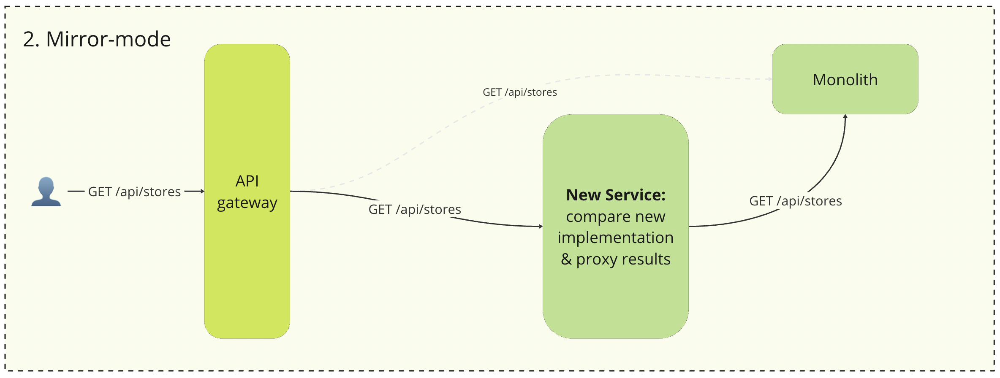
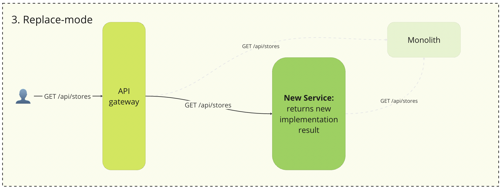

# Sbmt-strangler

Sbmt-strangler is an implementation of Strangler-pattern for replacing legacy system http endpoints with three stages: proxying, mirroring, replacing.

## Strangler Pattern

[The strangler pattern](https://microservices.io/patterns/refactoring/strangler-application.html) is a software design and architectural pattern used in the context of legacy system modernization or application migration. The pattern’s name comes from the way certain plants, like strangler figs, grow around host trees, eventually replacing or “strangling” them entirely. Similarly, the Strangler Pattern aims to replace or evolve an existing system gradually, without causing any significant disruptions to the overall system functionality.

## Features

 - **Automatic proxying**: with help of DSL, the proxying algorithm is effortlessly implemented. A Rails controller and a proxying client are dynamically created. All you need to provide is the processed URL and the address of the original service (refine Rails route is also necessary).
 - **Observability** - a comprehensive observability suite, with native support for [OpenTelementry](https://github.com/open-telemetry/opentelemetry-ruby), alongside proxy metrics based on the [Yabeda](https://github.com/yabeda-rb/yabeda) framework.
 - **Smooth Mode Switching** allows you to safely and smoothly switch between modes using the [Flipper](https://github.com/flippercloud/flipper)-based feature flags.
 - **Mirroring mode metrics** aid in tracking the accuracy and completeness of transferring business logic to a new service by comparing responses from both the legacy system and the new service.

# Usage

## Proxying

*Proxying* mode is a setup where traffic destined for the legacy system is first routed through the service, only to be fully redirected back to the legacy system. While the service doesn't offer any extra functionalities, it does gain control over the traffic, allowing for future replacements.

.

To determine the proxy mode, you need to:

1. Set the service path in the Rails controller, which will be generated automatically.
2. Specify the path to the legacy system and the HTTP verbs used.
3. Optionally, define a whitelist of proxied HTTP headers, as business logic can depend on them (original params & headers are available)

 ```ruby
 Sbmt::Strangler.configure do |strangler|
  strangler.controller("api/hello") do |controller|
    controller.headers_allowlist = %w[HTTP_API_VERSION HTTP_USER_AGENT HTTP_X_REQUEST_ID]
    controller.params_tracking_allowlist = %w[name surname]

    controller.action("index") do |action|
      action.proxy_url = "http://example.com:8080/api/hello"
      action.proxy_http_method = :post
    end
  end
 ```

## Mirroring

*Mirroring* is an approach where requests are simultaneously processed by both the service and the monolith. The outcomes are then compared to calculate an accuracy metric, enabling timely monitoring of the service's endpoint performance. Importantly, the client receives the result from the monolith, ensuring that mirroring does not affect user experience.

.

To determine the mirroring mode, it is necessary to describe the business logic of the endpoint which will run in parallel with the request's proxying in the legacy system. Depending on the result, the success/failure metric of the mirroring logic will be logged.

The mirroring mode involves comparing the results of the response from the legacy system with the results of calculations from the new implementation. To make this comparison, it is necessary to describe the corresponding lambda (compare).

 ```ruby
Sbmt::Strangler.configure do |strangler|
  strangler.controller("api/hello") do |controller|
    controller.headers_allowlist = %w[HTTP_API_VERSION HTTP_USER_AGENT HTTP_X_REQUEST_ID]
    controller.params_tracking_allowlist = %w[name surname]

    controller.action("index") do |action|
      action.proxy_url = "http://example.com:8080/api/hello"
      action.proxy_http_method = :post

      # new implementation of legacy system business logic
      action.mirror = ->(rails_controller) do
        name, surname = rails_controller.params.values_at(:name, :surname)
        {json: {greeting: "Hello, #{name} #{surname}!"}}
      end

      # compare legacy system response and mirror lambda calculation result
      action.compare = ->(origin_result, mirror_result) do
        origin_result[:status] == 200 &&
          JSON.parse(origin_result[:body]) == mirror_result[:json]
      end
    end
  end
end
 ```

## Replacement

*Replacement* refers to the process of substituting the functionality of a legacy system with a new implementation. In this scenario, the legacy system can either be completely removed from the framework or utilized to enhance the response outcomes of the new service.

 .


To enable replacement mode, use the feature flag. Replacement mode uses mirror lambda for replacement logic.
